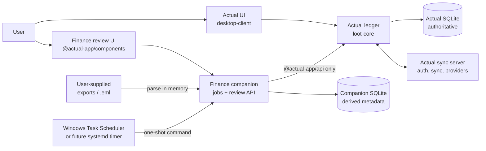
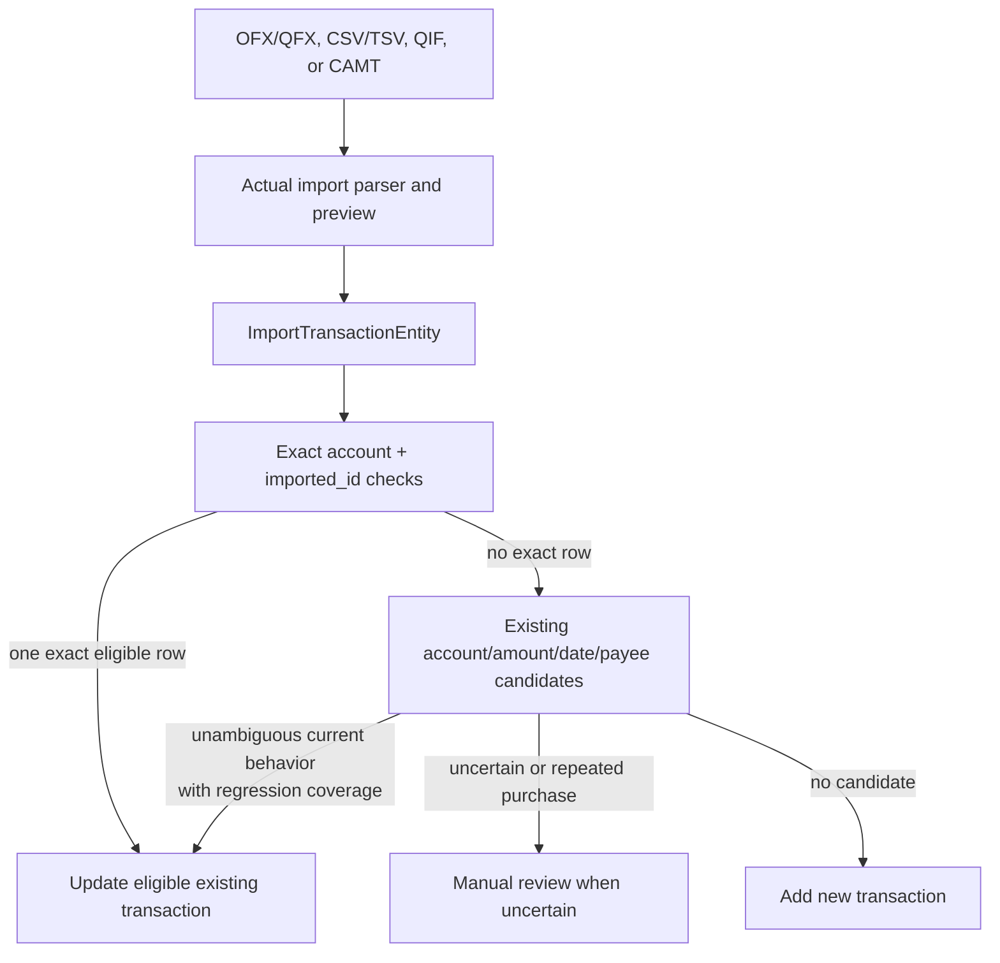
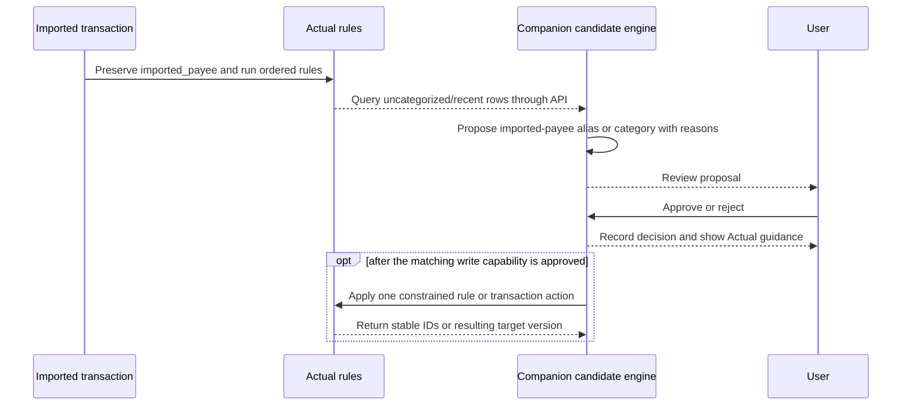
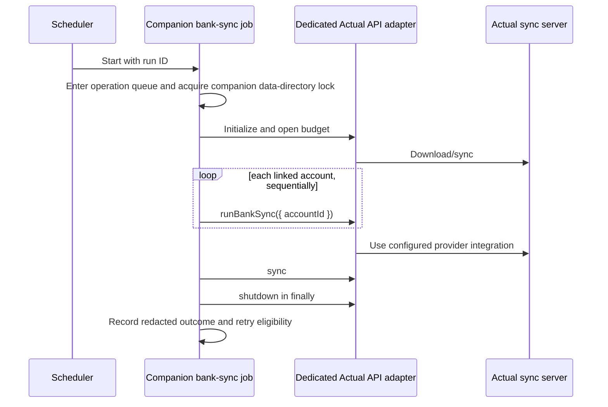
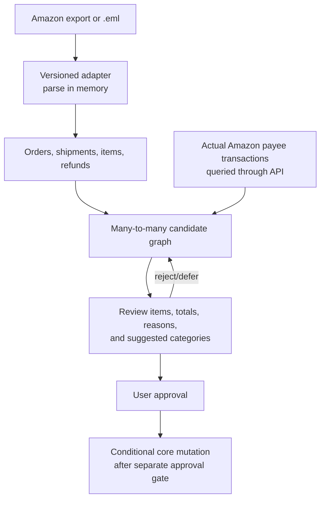

# Personal Finance App architecture

## Status

- Design ticket: FIN-3
- Baseline: Actual commit
  `822fbe3f96af21f276f3f41d686c796ddcd84285`
- Evidence:
  `docs/project/current-capabilities.md` and
  `docs/project/gap-analysis.md`
- Decision owner: lead agent
- Implementation status: design only until the approval record at the end of
  this document is complete

## Goals

The architecture must:

1. Keep Actual Budget as the authoritative financial ledger.
2. Reuse existing imports, rules, payees, reports, schedules, splits, bank
   providers, synchronization, and authentication.
3. Prevent silent financial-data corruption, especially duplicate removal or
   uncertain recategorization.
4. Add scheduled automation and optional enrichment without directly accessing
   Actual's SQLite database or internal sync protocol.
5. Keep custom changes small enough to rebase onto upstream.
6. Work locally on Windows and have a direct path to an Ubuntu homelab without
   deploying there now.

## Non-goals

- Replacing Actual's ledger, sync engine, provider integrations, or rules
  engine.
- A general financial-accounting platform or true multi-currency migration.
- A broad machine-learning classification system.
- Browser automation for Amazon or storage of Amazon passwords.
- General PDF/OCR statement ingestion in the first release.
- Public Internet exposure or automatic homelab deployment.
- Permanent uniqueness based only on date, amount, and merchant.

## Existing boundaries to preserve

| Boundary                                                                 | Owner                                                                         | Evidence                                                          |
| ------------------------------------------------------------------------ | ----------------------------------------------------------------------------- | ----------------------------------------------------------------- |
| Ledger, transactions, rules, schedules, imports, reconciliation, reports | `packages/loot-core`                                                          | `packages/docs/docs/contributing/project-details/architecture.md` |
| User interface                                                           | `packages/desktop-client` and `packages/desktop-electron`                     | Existing React/Vite and Electron packages                         |
| Reusable design system                                                   | `packages/component-library`                                                  | `@actual-app/components` exports                                  |
| Authentication, sync transport, bank-provider server routes              | `packages/sync-server`                                                        | `packages/sync-server/src/app.ts` and provider modules            |
| Supported headless automation                                            | `packages/api`                                                                | `packages/api/methods.ts`                                         |
| Supported shell automation                                               | `packages/cli`                                                                | `packages/cli/src/commands/server.ts`                             |
| Database migrations and AQL views                                        | `packages/loot-core/migrations` and `packages/loot-core/src/server/update.ts` | Migration documentation                                           |

The companion must not import server internals from `loot-core`, write an Actual
database, or invoke `/sync` routes. Its only ledger boundary is
`@actual-app/api` or the supported CLI.

## Selected topology

The selected design is a hybrid:

- **Existing Actual functionality** remains the default user path.
- **Targeted Actual changes** are permitted only where the ledger or existing
  report UI owns the behavior: exact same-batch duplicate suppression,
  regression-tested reconciliation semantics, missing expenditure metrics,
  and—only after the Phase 9 design gate—a conditional write boundary with a
  durable authoritative operation outcome.
- **A separable companion package** owns scheduled jobs and derived/review
  metadata for merchant proposals, classification reviews, subscription
  candidates, and Amazon enrichment.

The proposed package is `packages/finance-companion`. It may contain a small
Node service and React client in one workspace package to avoid premature
service layers. It can use `@actual-app/api` and `@actual-app/components`, but it
cannot import `loot-core` internals. Keeping it in one monorepo provides the
current development and test workflow; the interface allows later extraction
without moving financial data.

The exact version-one package map, configuration keys, DTOs, migration
ownership, adapter lifecycle, loopback authentication, idempotency, and
backup/restore interfaces are frozen in
`docs/project/finance-companion-v1-contract.md`.

## Data ownership

| Data                                                                 | Authoritative owner                                       | Rule                                                                                                                                          |
| -------------------------------------------------------------------- | --------------------------------------------------------- | --------------------------------------------------------------------------------------------------------------------------------------------- |
| Accounts, transactions, categories, payees, rules, schedules, splits | Actual                                                    | Never duplicated as an authoritative companion record                                                                                         |
| `imported_id`, cleared/reconciled state, transaction mutation        | Actual                                                    | Changed only through existing core/API behavior                                                                                               |
| Provider credentials                                                 | Actual sync-server secret store                           | Companion never reads provider access keys                                                                                                    |
| Actual API/session credential                                        | Process environment or ignored permission-restricted file | Never committed, ticketed, logged, or stored in companion SQLite                                                                              |
| Scheduler run state                                                  | Companion                                                 | Operational metadata only                                                                                                                     |
| Source namespace and import receipt                                  | Companion initially                                       | Advisory provenance for companion-assisted inputs                                                                                             |
| Reconciliation/classification/subscription candidates                | Companion                                                 | Derived and safely disposable                                                                                                                 |
| Amazon orders, shipments, items, and charge candidates               | Companion                                                 | Optional sensitive enrichment; normalized records only                                                                                        |
| Application receipts, unresolved allocation holds, and reservations  | Companion after the ledger-write gate                     | Durable integrity metadata; requires paired backup/restore                                                                                    |
| Durable companion-write operation outcome                            | Actual after the Phase 9 gate                             | Atomically records a receipt ID and action hash with every committed companion write; required for safe lost-response recovery                |
| Approved category/payee/split/note changes                           | Actual                                                    | Transaction writes require the conditional-mutator gate; rule/schedule writes also require their tested operation and remote-concurrency gate |
| Uploaded exports and raw email                                       | User/transient process memory                             | Delete after parse; do not persist raw content by default                                                                                     |

Deleting the companion database never deletes or rewrites Actual transactions.
Before ledger writes are enabled, it removes only reconstructible automation
history and derived metadata. After ledger writes are enabled, receipts and
allocation reservations are durable integrity metadata: deletion or an
unpaired restore forces the companion into read-only recovery mode and blocks
all later companion-led ledger writes.

## Supported interfaces

### Actual adapter

One module in the companion owns all calls to `@actual-app/api`:

1. Enter one process-wide operation queue for the configured budget.
2. Start one dedicated adapter worker process for the operation.
3. In the worker, acquire an exclusive cross-process lock for a
   companion-owned API data-directory root.
4. Initialize the module-global Actual API only after the operation owns both
   guards.
5. Download or open the configured budget in an operation-specific working
   directory.
6. Query only required fields through AQL or supported methods.
7. Call `sync` when the operation requires it.
8. On the normal path, call `shutdown`, release the lock, exit the worker, and
   only then release the queue slot.

The adapter returns companion-owned types so other modules do not depend on
Actual internals. The first adapter is read-only except for `runBankSync` and
`sync`; review approvals do not mutate Actual.

`@actual-app/api` is module-global and does not participate in the CLI lock.
Therefore every HTTP request, import, detector, approval check, and scheduled
job uses the same queue. The companion is the sole owner of its dedicated API
data directory. The CLI and another API process must never use that directory.
CLI automation, if retained for manual operations, uses a different data
directory and completes before the companion is started.

The companion lock can refuse another participating companion, but raw
`@actual-app/api` and CLI processes do not share it. Directory ownership is
therefore an explicit deployment invariant backed by an ownership marker and
configuration checks; the design does not claim it can stop an arbitrarily
misconfigured external process.

The portable companion lock is limited to a local NTFS/ext4-style filesystem.
Its atomically created owner record contains the PID, verified process-start
identity, and random nonce. Normal release removes it. Stale reclamation is
allowed only after the owner is proven absent and the directory ownership
marker matches; a network filesystem is unsupported.

`runBankSync` has no cancellation signal. A deadline therefore never releases
guards around a still-running promise. At a hard deadline the service
terminates the dedicated worker and waits for process exit, which releases OS
handles; the operation directory is quarantined instead of reused. Only then
may the verified-dead owner's stale lock be reclaimed. If termination cannot
be confirmed, the service stays unhealthy with the queue closed and starts no
new adapter operation.

A quarantined read-only operation directory may be removed only through its
tested retention policy. A write-operation directory is named by the receipt
ID, permission-restricted, and never deleted or reused while the receipt is
`applying`, `outcome_unknown`, or `failed_retryable`. A hard kill after local
Actual commit but before outcome synchronization leaves the receipt unknown.
Recovery reacquires the queue, lock, and remote fence and inspects or preserves
that quarantine until the local outcome is authoritatively synchronized or
Actual proves no commit. Paired backup includes unresolved write-operation
quarantines. P9.1 must specify this local-commit/sync boundary before any write
operation is enabled.

`batchBudgetUpdates` batches messages but does not provide transaction rollback
or compare-and-set semantics. A companion approval can mutate Actual only after
a separate targeted core/API design provides one server-owned conditional
mutation that:

- reads the current transaction and splits;
- rejects reconciled targets;
- validates the expected target-version hash;
- re-derives a deterministic proposed result, including any split child IDs,
  so the expected after hash is known before the call;
- validates the complete proposed update and split balance;
- accepts the companion receipt ID and canonical action hash as a stable
  operation identity;
- atomically records a durable Actual-side committed outcome for that operation
  in the same transaction as the supported change;
- returns an existing outcome without mutating again when the same operation ID
  and action hash are replayed, and rejects reuse with another hash;
- applies one supported change with proven transactional/serialization
  semantics; and
- returns the resulting target-version hash and authoritative operation
  outcome.

The local queue and target hash do not fence another synced Actual client. The
separate mutation design must also prove its pre-sync, post-sync, and
remote-client conflict behavior or add an approved distributed fence. Its
operation outcome must be queryable after restart and must have defined
migration, sync, retention, backup, and rollback semantics. This requirement
applies to transaction, rule, and schedule writes.

Receipt recovery never infers whether a write committed from the transaction's
current hash alone: a later remote edit or exact revert makes that inference
unsafe. If the durable Actual-side outcome cannot prove committed or no-commit
status, the companion retains the action as `outcome_unknown`, keeps any
allocation holds, and blocks the affected target and source capacities from
later companion writes. Until all local and remote race/failure tests pass,
approvals are read-only decisions with instructions to complete the edit in
Actual's UI.

Before any write capability is exposed, one immutable database event increments
the capability generation and chains the versioned capability contract to an
authenticated paired-backup manifest. The database row/event chain and external
anchor must carry the same generation/hash. Only one valid database-ahead event
may be completed after a crash; every other mismatch is
`recovery_required`.

Before the first Actual write call for each logical receipt, the serialized
companion transaction assigns one issued-write sequence and chain hash covering
the receipt ID, action hash, target, and any holds/quarantine identity. The
external integrity anchor must advance to and verify that issued intent before
the call begins. Every retry of the same receipt and exact action reuses and
reverifies that one anchored intent; it does not issue another sequence. A
changed action requires a new receipt and idempotency key.

A crash may leave the database exactly one valid intent ahead for startup to
finish, but an anchor ahead of restored companion state forces
`recovery_required`. This pre-call gate makes loss of an unresolved attempt
detectable even when Actual committed and the companion never finalized an
applied receipt.

### Companion HTTP/UI boundary

The first release binds only to `127.0.0.1` and serves its static UI and API
from the same origin. It refuses a non-loopback bind. Initial endpoints are
local and versioned:

- `GET /health`
- `POST /api/v1/session`
- `DELETE /api/v1/session`
- `GET /api/v1/runs`
- `POST /api/v1/jobs/bank-sync`
- `GET /api/v1/reviews`
- `POST /api/v1/reviews/:id/approve`
- `POST /api/v1/reviews/:id/reject`
- `POST /api/v1/imports/amazon`

This is an internal project contract, not a public API. Security requirements:

- require a high-entropy local owner credential initialized out of band and
  supplied from an environment variable or permission-restricted file; store
  only its slow password-hash and stable principal ID in companion state;
- never place the bootstrap credential in a URL, browser storage, log, issue,
  fixture, or database field;
- expose only a minimal `/health`, the login route, and static login shell
  without a session; every other API route requires authentication;
- verify the request's remote address is loopback and require the exact
  configured `Host` (`127.0.0.1:<port>`) on every request to resist DNS
  rebinding;
- no CORS responses and an exact same-origin allowlist;
- require the exact configured `Origin` on login and every mutating request;
- rate-limit login and compare the credential in constant time;
- rotate the session ID on login, keep sessions in memory, expire them after 30
  minutes idle or 12 hours absolute, revoke on logout, and invalidate all
  sessions on restart;
- an `HttpOnly`, `SameSite=Strict` local session cookie;
- a per-session CSRF token required in a custom header;
- JSON-only mutating endpoints except the authenticated/CSRF-protected upload
  endpoint;
- explicit request and upload size/type limits;
- idempotency keys bound to budget, the stable local owner principal rather
  than replaceable session ID, endpoint/action,
  and a canonical request hash; and
- allowlisted response bodies for idempotent replay.

Approval endpoints read the current Actual target through the serialized
adapter. Before the conditional core mutator exists they record only a review
decision. They never perform a read-then-write update that could overwrite a
concurrent Actual change.

The companion UI uses `@actual-app/components` for controls, spacing, themes,
loading indicators, and accessible primitives. It remains a separate local
route until Actual's plugin surface is stable. Remote/Tailscale access is not
enabled by the first release. A later homelab ticket must select a principal and
session model, reverse-proxy trust boundary, logout/expiry policy, CSRF policy,
and audit identity before allowing a non-loopback bind.

## Statement import flow

Supported native Actual import remains the first choice.

Phase 3 first pre-scans stable identifiers inside one incoming batch without a
schema change:

- normalized-identical repeats may collapse deterministically to one row;
- conflicting rows with the same ID produce no mutation for that ID and return
  an explicit error/review result; and
- an exact database lookup returning more than one existing row blocks
  mutation instead of choosing one.

It then adds fixtures around existing behavior. The open upstream CSV preview
work is not duplicated.

Companion-assisted import is optional and is introduced only if a supported
format needs source receipts or a manual candidate queue unavailable in the
native UI. The original file is parsed in memory; only a content hash, parser
version, counts, redacted error data, and normalized source records are kept.

PDF is accepted only by a future adapter after an institution-specific design
shows that no structured export exists. OCR output is always review-only.

## Reconciliation and duplicate semantics

The exact initial native identity, collision, field-merge, pending/posted,
manual/split, and migration-gate rules are frozen in
[`transaction-identity-contract.md`](transaction-identity-contract.md).

### Invariants

1. Actual account equality is a hard gate.
2. Monetary amount is represented in integer minor units.
3. A reconciled Actual transaction is never mutated by automatic import.
4. In the initial Actual implementation, exact identity means only the existing
   `(account, imported_id)` pair and can update one eligible transaction.
5. Native Actual `imported_id` has no source namespace, so the initial project
   never claims an exact cross-source merge.
6. A fingerprint is evidence, not identity.
7. Fuzzy candidates are never enforced as a database unique constraint.
8. The initial project does not auto-merge a changed-ID fuzzy candidate; it
   requires review unless an existing upstream behavior is covered and retained
   unchanged.
9. Two identical purchases on the same date remain valid independent
   transactions.
10. Every approval is idempotent and auditable.

### Tiered decision

| Tier | Evidence                                                                                                                | Initial action                                                                                           |
| ---- | ----------------------------------------------------------------------------------------------------------------------- | -------------------------------------------------------------------------------------------------------- |
| 1    | Same Actual account and `imported_id` under existing Actual semantics, with exactly one eligible existing row           | Exact automatic match if the existing row is not reconciled and the incoming ID group is non-conflicting |
| 2    | Same Actual account and another stable source correlation, such as a provider's explicit pending-to-posted relationship | Automatic only after a dedicated provider-neutral design and regression tests; otherwise review          |
| 3    | Same account and amount plus normalized merchant, bounded date difference, and pending/posted compatibility             | Candidate only                                                                                           |
| 4    | Incomplete or conflicting evidence                                                                                      | Manual review or add as new                                                                              |

The existing `imported_id` remains the only ledger source identifier during the
first hardening tickets. Companion namespaces protect only companion-owned
receipts; they do not strengthen a native Actual import or authorize
cross-source exact matching. A new Actual transaction-source table is not
approved by this document. Namespaced cross-source identity remains behind the
separate lead-owned migration gate in `docs/project/data-model.md`.

### Candidate score

Candidate generation may rank rows, but ranking does not authorize mutation.
The first score version uses explainable features:

- exact account and integer amount as hard gates;
- stable source relationship when present;
- normalized payee equality;
- absolute posting-date distance;
- pending-to-posted compatibility;
- whether one side is a manual transaction;
- whether either side is a split parent;
- a penalty for competing candidates; and
- an absolute prohibition on reconciled-row mutation.

The UI shows reason codes rather than a raw opaque probability alone.

## Categorization and merchant normalization flow

Actual's rule is authoritative. The companion stores only the proposal,
evidence, and decision. Initially, approval records the decision and gives
instructions for completing the change in Actual. A later approved merchant
capability may create or extend an imported-payee rename rule through one
idempotent supported rule operation. A category proposal may create a narrowly
scoped rule only when the user explicitly chooses that action and tests prove
that the operation cannot rewrite reconciled history or lose an intervening
remote-client edit. Direct transaction categorization remains read-only
guidance until the conditional transaction mutator is available.

Any companion-led action that targets an existing transaction rejects a
reconciled target both when creating the candidate and immediately before
application. The user may still edit through Actual's normal UI.

No background job silently recategorizes previously reviewed transactions.
Actual's deterministic category learning remains enabled at the user's choice.

## Scheduled bank synchronization

The companion supplies one idempotent one-shot command. Scheduling is external.

Policy:

- only one adapter operation in the process at a time, including HTTP reads and
  approval checks; the companion database is single-budget;
- bounded soft/hard deadlines implemented by the adapter-worker fail-stop
  protocol; never by abandoning a live API promise;
- exponential retry with jitter only for retryable failures;
- no retry for authentication or configuration failures until corrected;
- redacted account labels in ordinary logs;
- no provider payload, token, password, raw URL credential, or email content in
  logs;
- invoke `runBankSync({ accountId })` sequentially for each linked account so
  success/failure is attributable without parsing logs or internal provider
  results;
- explicit succeeded, failed, skipped, and canceled account results; and
- a hard kill or unproven final sync after provider work starts records a
  durable `outcome_unknown`, retains the operation quarantine, and forbids
  automatic same-key retry; and
- Windows Task Scheduler for local automation tests, with systemd timer or a
  container scheduler documented for the future homelab.

The public all-account `runBankSync()` throws only the first collected error and
does not expose a partial result contract, so the scheduler does not use that
call when it needs per-account status. The companion never receives SimpleFIN
or other provider credentials. Actual's sync server continues to own them.

## Expenditure metrics

Missing metrics belong in the existing report calculation/UI seam, not the
companion:

- average expenditure per day;
- average expenditure per week;
- median expense transaction size;
- month-over-month amount and percent change; and
- rolling 30-day expenditure.

A pure calculation module receives already filtered report rows and an explicit
date interval. It uses Actual's transfer, split, refund, and integer-money
semantics. Custom reports continue to own category/payee grouping and arbitrary
ranges. The new UI adds summary cards and a rolling series without rebuilding
the report editor.

The metric design must define empty ranges, partial days/weeks/months, positive
refunds, transfer exclusion, credit-card payments, split parents/children, and
the unsupported multi-currency case before implementation.

## Subscription candidate flow

Actual schedules remain authoritative recurring transactions. The companion:

1. Queries eligible historical transactions.
2. Normalizes them by Actual payee.
3. Reuses existing schedule/discovery signals where the API exposes them, or
   implements a separate read-only detector without changing transactions.
4. Evaluates weekly, monthly, quarterly, and annual cadence.
5. Calculates amount variance, billing-date variance, occurrence count, gaps,
   and recent price change.
6. Emits explainable confidence and a proposed type:
   `subscription`, `household-bill`, `financial-bill`, or `unknown`.
7. Lets the user reject, defer, or approve.
8. Initially records the decision and links the user to Actual. A later
   schedule-write capability may link or create an Actual schedule through one
   idempotent supported operation only after the remote-client concurrency gate
   passes. A candidate tied to a reconciled transaction remains read-only.

A candidate can be regenerated from the ledger. Rejecting it records a
suppression decision keyed to the payee/cadence signature; it does not alter
transactions.

## Amazon enrichment flow

Input priority:

1. User-supplied Amazon Request Your Data export.
2. User-supplied `.eml` confirmation, shipment, and refund messages.
3. A dedicated forwarded folder/mailbox in a later security-reviewed phase.
4. Never Amazon browser credentials or DOM scraping.

Matching accounts for:

- one order split into shipments and charges;
- several items per shipment;
- taxes, shipping, discounts, and gift-card allocations;
- partial refunds;
- one charge covering multiple orders; and
- one order producing multiple charges.

The graph uses exact order/shipment identifiers where available and an explicit
signed allocation from each Actual transaction to each Amazon item/refund.
Integer totals and per-order, per-item, and per-transaction capacity are
validated across all already-applied match groups. Date/amount similarity only
ranks candidates.

The initial Amazon UI is read-only: it can show item detail and proposed splits,
but the user completes the edit in Actual. Automated approved application is
enabled only after the conditional core mutator can reject reconciled/stale
targets and apply one balanced parent/split update. A many-transaction match
group is applied as independent per-parent requests and receipts, with visible
partial progress; one receipt never covers several parents. The same charge,
order capacity, item capacity, or refund capacity cannot be applied twice.
Before calling Actual, the companion creates allocation holds for the one
receipt. It converts them to applied reservations only after reading the
matching durable committed outcome from Actual. An unknown outcome retains its
holds and prevents either the Actual target or source capacity from being
reused.

Raw email bodies and export archives are not stored by default. The companion
stores normalized item data, source hashes, parser versions, and the minimum
provenance needed to explain an approved match. Item descriptions are sensitive
and require the same host/backup protection as financial data.

Normalization is crash-safe: the receipt may be created first, but canonical
upserts, immutable observations, counts, and the `parsed` transition commit in
one companion transaction. A retry after any earlier crash resumes the same
content receipt and cannot duplicate canonical children.

## Review UI contract

Every review screen must support:

- loading with an accessible label;
- an empty state that explains how candidates are generated;
- a success state that identifies the human-readable affected account/payee;
- a recoverable error state with a retry action;
- a stale state when the Actual transaction changed after candidate creation;
- keyboard navigation and visible focus;
- responsive layouts;
- reason codes and source labels without exposing raw technical IDs;
- explicit selection when several candidates compete;
- confirmation before recording any decision and, after a capability gate,
  before category, rule, schedule, split, or note mutation; and
- undo guidance that maps to an Actual edit or an idempotent companion
  rejection.

Candidate creation excludes reconciled transaction targets. Approval checks
again immediately before any transaction mutation. Until the conditional core
mutator is implemented, the review records the decision and guides the user to
Actual's UI; it does not promise compare-and-set behavior.

After the local mutator and the separate remote-sync concurrency gate exist,
the server validates the target version and reconciled state inside the
server-owned mutation. A stale or reconciled approval returns a conflict. If
intervening remote-client edits cannot be detected without overwrite, ledger
application remains disabled.

## Secret management and privacy

Configuration names may be documented, but values never are:

- Actual server URL;
- budget sync ID;
- Actual password or session token;
- high-entropy local owner bootstrap credential;
- external integrity-anchor MAC key stored outside companion `/data`;
- companion remote session/signing secret if remote access is later approved;
  and
- optional source encryption key if normalized sensitive payload encryption is
  added.

Local development uses process environment variables or ignored,
permission-restricted files outside the companion database. Ubuntu uses a
permission-restricted environment file or secret manager mounted read-only.
The write-era integrity anchor is also outside the ordinary companion database
restore domain. Logs use an allowlist of fields and structured error codes
rather than serializing thrown request/provider objects.

The first release is loopback-only with no override. A future remote-access
design must be approved before the service accepts another bind address. That
design should use Tailscale-only access, TLS at the reverse proxy, an explicit
authenticated principal/session that does not reuse the loopback bootstrap
credential, full-disk or encrypted-volume protection, and separate backup
encryption.

## Local Windows layout

The supported local workflow is:

- Node 22 selected through NVM;
- repository Yarn 4.17.1;
- PowerShell for orchestration;
- Git Bash only for upstream Bash scripts;
- Actual browser client on its configured development port;
- companion service/UI on a different loopback port; and
- a project-local companion data directory containing only synthetic data
  during development, plus a separate ignored integrity-anchor directory and
  read-only MAC-key file with restricted permissions.

Paths containing spaces are a required test case. No script may assume `/bin`,
an unquoted `$0`, or a Unix-only path.

## Ubuntu homelab path

Deployment remains out of scope, but the designed service set is:

| Service           | Purpose                              | Network                               | Persistence                                             |
| ----------------- | ------------------------------------ | ------------------------------------- | ------------------------------------------------------- |
| Actual server     | Existing web/sync/provider service   | Private port 5006                     | Actual `/data` volume                                   |
| Finance companion | One-shot jobs and review UI/API      | Future private port after auth design | Companion `/data` plus distinct `/integrity-anchor`     |
| Scheduler         | Invokes one-shot sync/detection jobs | No public listener                    | Logs/run state only                                     |
| Reverse proxy     | TLS and private routing              | Tailscale interface                   | Configuration                                           |
| Backup job        | Snapshot/export and verification     | No public listener                    | Encrypted backup target; anchor transition is validated |

The eventual companion image is built from a repository Dockerfile, runs as a
fixed non-root UID/GID, uses a read-only root filesystem, exposes one internal
health/UI port only after remote authentication is designed, and writes only to
owned `/data`, `/integrity-anchor`, and `/tmp`. `/integrity-anchor` is a
distinct durable mount outside the companion database restore domain. Its MAC
key is injected through a separate read-only secret mount and is never stored
with either writable volume. Compose pins the reviewed image digest or version
and uses named/bind volumes with documented non-root ownership.

A consistent upgrade backup performs these steps:

1. Pause the scheduler, stop new requests, and enter one exclusive backup
   operation that owns the queue; internal adapter calls must not recursively
   reacquire it.
2. Acquire the exclusive companion lock.
3. For a write-enabled instance, acquire the approved remote-write fence or
   sync-version proof from the Phase 9 concurrency contract. Abort if another
   client can change the budget undetected.
4. Call Actual `sync` through the already-owned adapter operation, create a
   budget export, and verify that the export opens in an isolated data
   directory.
5. Stop/quiesce the Actual and companion services before raw volume snapshots.
6. Create a checkpoint-consistent companion SQLite backup using the SQLite
   online backup API or `VACUUM INTO`; never copy only the main file while WAL
   writes are possible.
7. Snapshot Actual `/data` and companion `/data`, and read the authenticated
   pre-backup value from the separate `/integrity-anchor` mount.
8. Verify the remote fence or sync version still covers the export and
   snapshots; discard the set on mismatch.
9. Copy the authenticated pre-backup anchor artifact, but never its MAC key,
   and every unresolved write-operation quarantine into the encrypted backup
   set. Create one manifest binding the Actual export/snapshot hashes,
   companion backup hash, schema version, pre-backup anchor artifact hash,
   capability generation/event hash, quarantine/account-operation bindings, and
   the last issued-intent and applied-receipt chain hashes.
10. Encrypt and finalize the export/snapshots/anchor artifact/manifest and
    verify checksums. Only then atomically advance the live anchor's
    `last_verified_paired_backup_manifest_hash` to the finalized manifest hash.
    The manifest does not embed this post-finalization anchor, avoiding a
    circular hash. After the separately gated remotely fenced paired-restore
    operation lands, restore verifies the pre-backup anchor and manifest, then
    reconstructs that one deterministic anchor transition.
11. Update one service, run health/migration/synthetic smoke checks, and then
    resume scheduling.

Generation-zero rollback stops the companion, restores its matching verified
companion-only set, reconstructs the generation-zero anchor, and remains
write-disabled. Write-era rollback is unavailable until the separately gated
remotely fenced paired-restore protocol can restore the matching pre-upgrade
Actual/companion/anchor images and verify them in isolation. A post-migration
database is not assumed to be backward compatible. A write-enabled companion
is never restored independently of the paired Actual snapshot/export. Missing,
mismatched, or older companion integrity metadata sets `recovery_required`;
writes remain disabled because this design has no automatic reconstruction or
reset path.

## Alternatives considered

| Alternative                                             | Decision                                                    | Reason                                                                                                                             |
| ------------------------------------------------------- | ----------------------------------------------------------- | ---------------------------------------------------------------------------------------------------------------------------------- |
| Configuration only                                      | Use wherever sufficient                                     | Covers imports, most reporting, rules, payees, schedules, splits, and providers, but not all requested automation/metrics/review   |
| External scripts using CLI only                         | Supported manual alternative with a separate data directory | Excellent for one-shot sync, but its lock does not coordinate with the module-global API and it is insufficient for durable review |
| Supported API companion                                 | Selected                                                    | Maintains the ledger boundary and can own disposable derived metadata                                                              |
| Client-side plugin                                      | Deferred                                                    | Current plugin UI is disabled/experimental                                                                                         |
| Put all metadata in Actual migrations                   | Rejected initially                                          | Unnecessary upstream divergence and migration risk                                                                                 |
| Direct Actual SQLite or sync access                     | Rejected                                                    | Bypasses supported models, mutators, migrations, AQL, and sync coordination                                                        |
| Implement every feature in `desktop-client`/`loot-core` | Rejected                                                    | Creates a long-lived architectural fork                                                                                            |
| Separate companion repository immediately               | Deferred                                                    | Adds project/release overhead before interfaces stabilize; strict package boundaries preserve extraction                           |
| Browser scrape Amazon                                   | Rejected                                                    | Unsafe credentials, brittle behavior, and privacy risk                                                                             |
| General PDF parser                                      | Deferred                                                    | High false-output risk when structured formats are available                                                                       |

## Migration strategy

1. Initial Actual fixes use no schema migration.
2. The companion starts with an empty, versioned SQLite database containing
   only derived/project metadata.
3. Companion migrations are forward-only. While writes have never been
   enabled, the service may pause operations, acquire its exclusive lock, and
   create and verify a checkpoint-consistent companion-only backup before the
   migration transaction.
4. The required generation-zero integrity anchor is not a write-era marker by
   itself. Once write capability generation is positive, an issued/applied
   chain or receipt exists, or a bank-sync/write quarantine is unresolved,
   every migration uses the full remotely fenced, paired
   Actual/companion/anchor upgrade-backup protocol above. A companion-only
   migration backup or rollback is then forbidden; inability to complete the
   paired protocol leaves the service fail-closed.
5. Actual transaction-source provenance requires a separate design ticket and
   is not silently introduced by an implementation agent.
6. No migration backfills or deduplicates existing transactions automatically.
7. A write-disabled rollback may restore its verified companion-only backup.
   A write-enabled rollback remains fail-closed until the paired-restore gate
   lands, then restores only the paired set and prior images; down migrations
   are not assumed safe after user-approved mutations.

## Rollout strategy

1. Land documentation and Windows baseline compatibility.
2. Add test-only reconciliation fixtures, then the same-batch exact-ID guard.
3. Validate existing user workflows with synthetic data.
4. Build the smallest companion skeleton and read-only Actual adapter.
5. Add the per-account one-shot scheduled sync command.
6. Add missing report metrics behind focused tests.
7. Add read-only subscription candidates and review.
8. Add Amazon adapters, signed allocations, and review without ledger mutation.
9. Separately design and implement the server-owned conditional Actual write
   boundary with durable outcomes, deterministic before/after state,
   reconciled, local/remote sync race, rollback, and idempotency tests.
10. Enable approved note/split/category/rule/schedule application only through
    that boundary.
11. Run full synthetic E2E, accessibility, security, backup, and Ubuntu
    readiness gates.

Each step is independently reversible and may ship only when its Linear ticket
and PR acceptance criteria pass.

## Acceptance criteria for this design

- Actual ownership and the companion boundary are explicit.
- Every requested flow has an owner and an implementation path.
- The duplicate hierarchy separates identity from fuzzy evidence.
- Reconciled and uncertain transactions are protected.
- Secrets and raw source data have explicit handling and retention.
- UI confirmation and stale-state behavior are defined.
- Windows and Ubuntu constraints are present.
- Alternatives, migration, rollout, rollback, and tests are documented.
- Child tickets are created from the reviewed interfaces and only bounded
  tickets receive `agent-ready`.

## Lead approval record

- Approval date: 2026-07-30
- Reviewed content commit:
  `11c6f852040869c1146f254b1278d72fd3e06e39`
- Independent security and financial-integrity gates:
  `/root/fin3_security_integrity_gate_3` — APPROVE;
  `/root/fin3_final_security_gate_2` — APPROVE
- Roadmap and live Linear mapping gate:
  `/root/fin3_linear_mapping_gate_2` — APPROVE
- Lead decision: approved as the governing FIN-3 architecture, data model,
  test strategy, and implementation roadmap.

The approval covers the 51 one-to-one child-ticket mappings recorded in
`docs/project/implementation-roadmap.md`. After FIN-3 merges, only FIN-4,
FIN-6, and FIN-5 (P0.1, P0.2, and P0.3) may become `agent-ready`
immediately. Every other child remains blocked by its named design and
implementation dependencies. This approval does not enable any companion-led
Actual write; those capabilities remain fail-closed behind their Phase 9
gates.
