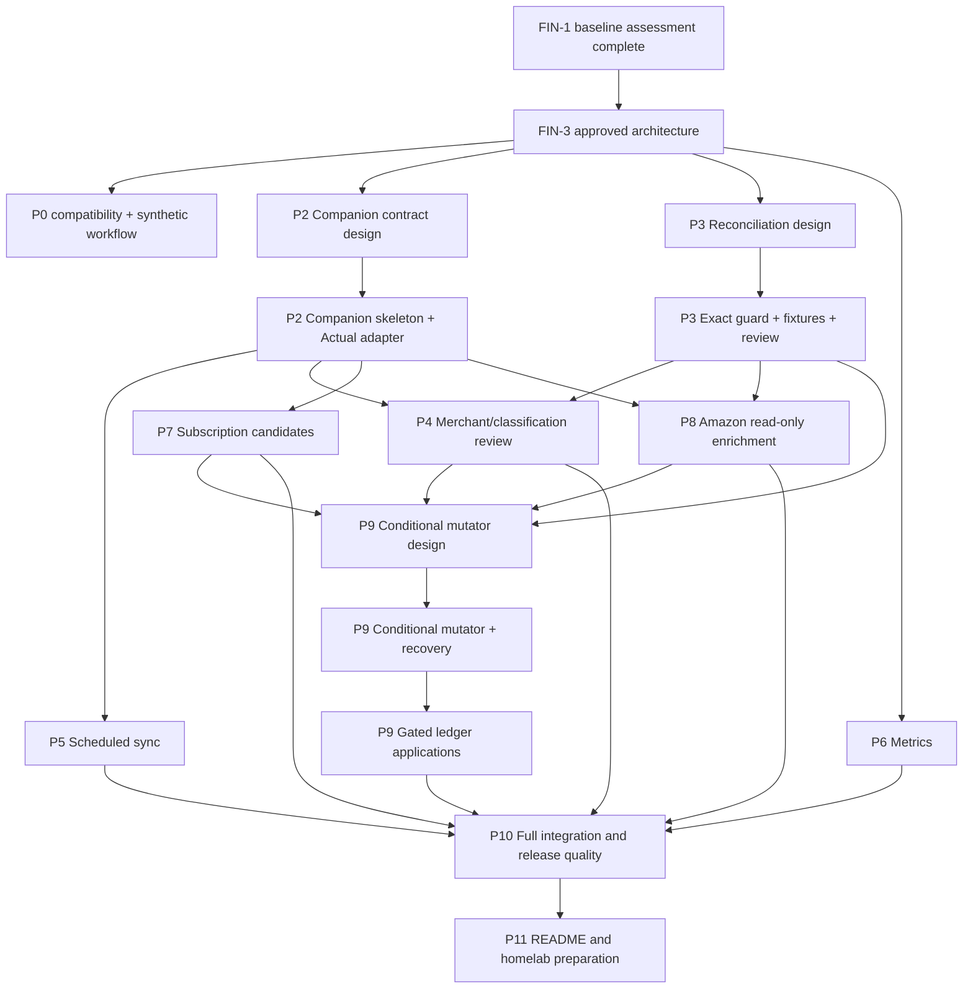

# Personal Finance App implementation roadmap

## Purpose

This roadmap turns the FIN-3 architecture into independently reviewable work.
It is evidence-based but intentionally staged: implementation tickets do not
become `agent-ready` until their parent design and exact interfaces have lead
approval.

The integration target for every project PR is `integration/finance-app`.
`master` remains synchronized with upstream and receives no direct project
pushes.

## Current state

| Phase                            | Status      | Evidence                    |
| -------------------------------- | ----------- | --------------------------- |
| 0a — Repository/tooling baseline | Complete    | FIN-1 and PR #1             |
| 0b — Windows compatibility fixes | Backlog     | P0.1-P0.3 after FIN-3       |
| 1 — Capability assessment        | Complete    | FIN-2 and PR #2             |
| 1b — Architecture and backlog    | In progress | FIN-3                       |
| 2–11                             | Backlog     | Begins after FIN-3 approval |

## Delivery principles

1. Use Actual configuration and existing UI before adding code.
2. Add tests before changing financial-integrity behavior.
3. Keep the companion non-authoritative and separable.
4. Do not combine a schema migration with unrelated behavior or UI.
5. Keep fuzzy matching reviewable.
6. Use synthetic data only.
7. One Linear ticket, branch, and focused PR per logical change.
8. The lead reviews every diff and runs independent validation.
9. UI work is not complete without all states, accessibility, screenshots, and
   browser verification.
10. No homelab deployment occurs in this project.

## Critical path

## Work packages

The stable work-package keys below map one-to-one to the child Linear backlog.
They remain the durable cross-reference when ticket titles change.

### Phase 0 — Development foundation

| Key  | Work                                                     | Type               | Dependency | Delegation                                 | Definition of done                                                                                             |
| ---- | -------------------------------------------------------- | ------------------ | ---------- | ------------------------------------------ | -------------------------------------------------------------------------------------------------------------- |
| P0.1 | Fix Windows lint resolution for budget component imports | Implementation/bug | FIN-1      | Agent-ready after FIN-3 approval           | Eliminate both findings without weakening lint; Windows and Linux-compatible module resolution pass            |
| P0.2 | Make loot-core SQLite test teardown reliable on Windows  | Implementation/bug | FIN-1      | Agent-ready after FIN-3 approval           | Close owned handles before scoped cleanup; targeted tests pass repeatedly with no residue or skipped assertion |
| P0.3 | Quote development launcher paths containing spaces       | Implementation/bug | FIN-1      | Agent-ready after FIN-3 approval           | Supported start command works from a spaced checkout in its documented shells                                  |
| P0.4 | Build reusable synthetic finance workflow fixtures       | Testing            | FIN-3      | Agent after the issue fixes the module API | Fixed IDs/dates/integer amounts and finance entities; no committed database; safe Windows/Linux cleanup        |

The three baseline defects remain separate because they affect unrelated
files, failure modes, and validation commands. They are the first implementation
candidates after this design is approved. P0.4 remains blocked until its
Linear issue names the exact helper module and public fixture API.

### Phase 2 — Existing baseline and companion foundation

| Key  | Work                                                        | Type                    | Dependency       | Delegation                      | Definition of done                                                                                                |
| ---- | ----------------------------------------------------------- | ----------------------- | ---------------- | ------------------------------- | ----------------------------------------------------------------------------------------------------------------- |
| P2.1 | Validate existing import/rule/report/schedule/split flows   | Testing/documentation   | FIN-2, P0.1-P0.4 | Agent setup; lead UI acceptance | Synthetic browser workflow and exact current limitations documented                                               |
| P2.2 | Freeze companion v1 package and adapter contract            | Design/security         | FIN-3            | Lead only                       | Package/DTO/schema, local auth, worker/lock/fail-stop, external anchor, idempotency and backup contracts approved |
| P2.3 | Scaffold `@actual-app/finance-companion`                    | Implementation          | P2.2             | Agent after design approval     | Planned scripts exist, root Lage tasks discover build/typecheck/test, allowed imports only                        |
| P2.4 | Implement companion database lifecycle and migration backup | Implementation          | P2.2, P2.3       | Agent after schema approval     | Binding/migrations plus external freshness anchor, fail-closed restore state, consistent backup/crash tests       |
| P2.5 | Implement loopback same-origin HTTP security boundary       | Implementation/security | P2.2, P2.3, P2.4 | Agent; lead security review     | Local credential/authentication, exact Host/Origin, session lifecycle/CSRF, no CORS, upload/traversal limits      |
| P2.6 | Implement request idempotency and safe replay               | Implementation          | P2.4, P2.5       | Agent after DTO approval        | Budget/principal/action/request binding, mismatch conflict, stored allowlisted replay, concurrency tests          |
| P2.7 | Implement serialized allowlisted Actual adapter             | Implementation          | P2.2-P2.5        | Agent after contract approval   | Dedicated worker, exact allowlist, local lock/stale recovery, ownership checks, hard-deadline fail-stop tests     |

P2.3 and report design may run in parallel because they do not touch the same
files. P2.7 has an exact allowlist: init/download/read/query, `sync`,
account-scoped `runBankSync`, and `shutdown`. It exposes no generic or review
mutation. No review ticket can infer a ledger write from this adapter.
The frozen package, configuration, DTO, migration, adapter, authentication,
idempotency, and backup interfaces are in
`docs/project/finance-companion-v1-contract.md`.

### Phase 3 — Import and reconciliation hardening

| Key  | Work                                                             | Type               | Dependency       | Delegation                       | Definition of done                                                                                                           |
| ---- | ---------------------------------------------------------------- | ------------------ | ---------------- | -------------------------------- | ---------------------------------------------------------------------------------------------------------------------------- |
| P3.1 | Finalize native identity and reconciliation semantics            | Design             | FIN-3            | Lead only                        | Native `(account, imported_id)`, conflict/ambiguity behavior, pending/posted, reconciled/cleared locks, migration gate fixed |
| P3.2 | Characterize existing import and reconciliation behavior         | Testing            | P3.1             | Agent-ready only after P3.1 Done | Passing tests capture account/ID, reconciled, manual, split, no-ID, and legitimate-repeat upstream behavior                  |
| P3.3 | Guard same-batch stable-ID collisions                            | Implementation/bug | P3.1, P3.2       | Agent after regression coverage  | Identical rows collapse; conflicting IDs mutate nothing for that group; multiple existing exact rows block                   |
| P3.4 | Implement companion source identities and immutable observations | Implementation     | P2.4, P3.1       | Agent after schema approval      | Minimal namespaces, account scope, canonical pending-to-posted state, immutable observations, no credential table            |
| P3.5 | Implement scoped import receipts and parser replay               | Implementation     | P2.4, P2.6, P3.4 | Agent after schema approval      | Atomic normalize/observe/status transaction; crash resume; scoped keys; raw removal; no silent reapplication                 |
| P3.6 | Implement read-only reconciliation candidate generation          | Implementation     | P2.7, P3.2, P3.4 | Agent after matcher DTO approval | Explainable candidates; changed IDs/fuzzy matches review-only; reconciled targets non-actionable; hash is evidence           |
| P3.7 | Add shared read-only reconciliation review shell and UI          | Implementation/UI  | P2.5, P3.6       | UI agent; lead acceptance        | Owns shared routes/state/components; all review states; decision records guidance and leaves Actual unchanged                |

P3.2 lands before P3.3. P3.4 must not add the gated Actual
`transaction_sources` table. P3.7 receives final financial-integrity and UI
acceptance from the lead. Ledger application is a separate Phase 9 capability.

### Phase 4 — Merchant normalization and classification

| Key  | Work                                                       | Type                    | Dependency             | Delegation                          | Definition of done                                                                                                           |
| ---- | ---------------------------------------------------------- | ----------------------- | ---------------------- | ----------------------------------- | ---------------------------------------------------------------------------------------------------------------------------- |
| P4.1 | Define merchant, classification, and rule-write operations | Design                  | P3.1                   | Lead only                           | Eligibility, reconciled exclusion, reasons, stale/conflict, narrow rule-write and one-time action shapes approved            |
| P4.2 | Implement merchant/classification proposal service         | Implementation          | P2.7, P4.1             | Agent after DTO approval            | Explainable proposals, reject/suppress/stale behavior, no Actual mutation                                                    |
| P4.3 | Add read-only merchant/classification review UI            | Implementation/UI       | P2.5, P3.7, P4.2       | UI agent; lead acceptance           | One-time versus rule decision is explicit; all states; Actual remains unchanged                                              |
| P4.4 | Implement constrained idempotent rule-write capability     | Implementation/security | P2.6, P4.1, P4.2, P9.3 | Agent only after P4.1/P9.3 approval | Supported operation, authoritative outcome/receipt, remote-race safety, replay, no reconciled-history rewrite; failure tests |
| P4.5 | Enable explicit merchant/category rule action              | Implementation/UI       | P4.3, P4.4             | UI agent; lead acceptance           | Separate confirmation, stable result, retry/replay behavior, and safe Actual undo guidance                                   |

P4.2 and the report calculation ticket may run in parallel. P4.3 cannot
overlap the shared review shell while P3.7 is changing it. `categorize_once`
ledger application remains in Phase 9.

### Phase 5 — Scheduled bank synchronization

| Key  | Work                                                            | Type                  | Dependency       | Delegation                  | Definition of done                                                                                      |
| ---- | --------------------------------------------------------------- | --------------------- | ---------------- | --------------------------- | ------------------------------------------------------------------------------------------------------- |
| P5.1 | Define per-account scheduled sync policy                        | Design/security       | P2.2             | Lead only                   | Account loop, worker soft/hard deadlines, retry/partial/exit/redaction, quarantine and invocation fixed |
| P5.2 | Implement one-shot per-account bank-sync job                    | Implementation        | P2.6, P2.7, P5.1 | Agent after policy approval | Sequential calls, hard-timeout worker join/quarantine, explicit outcomes, final sync/lifecycle tests    |
| P5.3 | Add scheduler reliability/security tests and local instructions | Testing/documentation | P5.2             | Agent; lead security review | Windows Task Scheduler example, complete failure matrix, no provider credential copied                  |

This phase does not add provider code. User credentials are required only for a
later real local connection and are never placed in automated tests.

### Phase 6 — Expenditure metrics

| Key  | Work                                          | Type              | Dependency | Delegation                               | Definition of done                                                                                        |
| ---- | --------------------------------------------- | ----------------- | ---------- | ---------------------------------------- | --------------------------------------------------------------------------------------------------------- |
| P6.1 | Define missing metric semantics and report UI | Design            | FIN-3      | Lead                                     | Denominators, empty/partial ranges, median, MoM, rolling window, transfer/refund/split semantics approved |
| P6.2 | Implement pure metric calculations            | Implementation    | P6.1, P0.4 | Agent after semantics approval           | Table-driven unit matrix passes with integer money and injected clock                                     |
| P6.3 | Add report summary cards and rolling series   | Implementation/UI | P6.2       | Cheaper UI agent; lead manual acceptance | Existing report range/filter reused, responsive accessible states, screenshots/E2E                        |

P6 work does not depend on the companion and can proceed in parallel with P2/P3
after the shared semantics are approved.

### Phase 7 — Subscription candidates

| Key  | Work                                                      | Type              | Dependency             | Delegation                          | Definition of done                                                                                                                   |
| ---- | --------------------------------------------------------- | ----------------- | ---------------------- | ----------------------------------- | ------------------------------------------------------------------------------------------------------------------------------------ |
| P7.1 | Define subscription scoring and schedule operations       | Design            | P2.2                   | Lead only                           | Cadence, variance, gaps, type, suppression, stale/reconciled-derived behavior, schedule shape fixed                                  |
| P7.2 | Implement read-only subscription detector                 | Implementation    | P2.7, P7.1, P0.4       | Agent after scoring approval        | Weekly/monthly/quarterly/annual matrix, price/gap reasons, no ledger mutation                                                        |
| P7.3 | Add read-only subscription review UI                      | Implementation/UI | P2.5, P7.2             | UI agent; lead acceptance           | Reject/defer/decision, existing schedule display, stale state, Actual unchanged                                                      |
| P7.4 | Implement and enable idempotent schedule-write capability | Implementation/UI | P2.6, P7.1, P7.3, P9.3 | Agent only after P7.1/P9.3 approval | Existing link/create with authoritative outcome/receipt, remote-race safety and replay; reconciled-derived candidate stays read-only |

The detector and Amazon parser may run in parallel after the companion adapter
is stable because they use separate modules and tables.

### Phase 8 — Amazon enrichment

| Key  | Work                                                      | Type              | Dependency       | Delegation                                      | Definition of done                                                                                                  |
| ---- | --------------------------------------------------------- | ----------------- | ---------------- | ----------------------------------------------- | ------------------------------------------------------------------------------------------------------------------- |
| P8.1 | Define Amazon identity, retention, and signed allocations | Design/security   | P2.2, P3.1       | Lead only                                       | Export/email keys, observations, 365-day purge, privacy, signed edges, cross-applied capacities, read-only boundary |
| P8.2 | Implement Amazon export canonical upserts                 | Implementation    | P2.4, P3.5, P8.1 | Parser agent after DTO approval                 | Versioned adapter, stable children/observations, atomic crash/retry, raw deletion, redacted failures                |
| P8.3 | Implement Amazon `.eml` canonical upserts                 | Implementation    | P2.4, P3.5, P8.1 | Separate parser agent when files do not overlap | Same canonical identities, atomic crash/retry, observation provenance, duplicate/reparse/conflict tests             |
| P8.4 | Implement signed Amazon matching/allocation engine        | Implementation    | P2.7, P8.2, P8.3 | Agent after allocation DTO approval             | Direct transaction-item/refund edges, exact signs/totals, capacity across applied groups, candidates only           |
| P8.5 | Add read-only Amazon review UI                            | Implementation/UI | P2.5, P3.7, P8.4 | UI agent; lead acceptance                       | Competing selection, sensitive item display, exact proposed splits, stale/reconciled states, Actual unchanged       |

No Gmail connector is part of P8.3. A dedicated read-only mailbox is a future
security design after file-based adapters work.

### Phase 9 — Conditional ledger mutation

| Key  | Work                                                                  | Type                    | Dependency                   | Delegation                         | Definition of done                                                                                                                         |
| ---- | --------------------------------------------------------------------- | ----------------------- | ---------------------------- | ---------------------------------- | ------------------------------------------------------------------------------------------------------------------------------------------ |
| P9.1 | Design distributed-safe Actual write and transaction-mutator boundary | Design/security         | P3.6, P4.1, P7.1, P8.1, P8.4 | Lead only                          | Remote fence, durable outcome, and local-commit/quarantine sync semantics for every transaction/rule/schedule write approved               |
| P9.2 | Implement conditional transaction mutator                             | Implementation/core     | P9.1                         | Agent after design approval        | One winner; atomic mutation/outcome; replay returns outcome; local-before-sync and stale/reconciled/injected failures are fail-closed      |
| P9.3 | Implement Actual-write application receipts and crash recovery        | Implementation/security | P2.4, P2.6, P9.2             | Agent after recovery review        | General targets, one anchored intent per logical receipt, stable principal/action, unknown quarantine/holds, authoritative recovery/replay |
| P9.4 | Enable reconciliation application through the mutator                 | Implementation          | P3.7, P9.3                   | Agent after integrity review       | Exact source/candidate revalidation; no fuzzy automatic merge; replay safe                                                                 |
| P9.5 | Enable one-time classification through the mutator                    | Implementation/UI       | P4.3, P9.3                   | Service then UI agent              | Reconciled/category-deletion/stale conflicts; `categorize_once` creates no rule                                                            |
| P9.6 | Enable Amazon note/split application through the mutator              | Implementation/UI       | P8.5, P9.3                   | Service then UI agent; lead review | One parent per receipt, visible partial progress, balanced split, pre-call holds, reservations, no double apply, authoritative recovery    |

No Phase 9 implementation becomes `agent-ready` until P9.1 is approved. The
initial companion remains useful and safe without this phase.

FIN-42 concluded that the current Actual API and sync protocol cannot provide
an authoritative cross-client fence or an atomic ledger-write outcome. The
decision and required future boundary are recorded in
[`distributed-write-boundary.md`](distributed-write-boundary.md). Therefore
`write_capability_state` remains `disabled`; FIN-43 through FIN-47 and Actual
rule/schedule creation remain deferred. Read-only review and companion-only
metadata operations continue.

### Phase 10 — Integration and release quality

| Key   | Work                                                                 | Type                         | Dependency                         | Delegation                                      | Definition of done                                                                                                               |
| ----- | -------------------------------------------------------------------- | ---------------------------- | ---------------------------------- | ----------------------------------------------- | -------------------------------------------------------------------------------------------------------------------------------- |
| P10.1 | Add cross-feature E2E, accessibility, and visual coverage            | Testing/UI                   | P3.7, P4.3, P5.3, P6.3, P7.3, P8.5 | Parallel non-overlapping specs; lead integrates | Read-only flows pass; each completed P9.4-P9.6 capability adds its gated flow                                                    |
| P10.2 | Add Ubuntu non-root container readiness checks                       | Testing/deployment readiness | P2.3-P2.7                          | Agent; lead operations review                   | Fixed UID/GID; owned `/data`, distinct `/integrity-anchor`, `/tmp`; read-only MAC secret/root; internal-only health/UI, shutdown |
| P10.3 | Verify consistent Actual/companion backup and restore                | Testing/security             | P2.4, P9.1, P9.3, P10.2            | Agent setup; lead executes final restore        | Non-recursive queue/lock, remote fence, two-phase anchor, bound quarantine/backup/chain manifest, paired fail-closed restore     |
| P10.4 | Perform final security, migration, integrity, and performance review | Review                       | P10.1-P10.3                        | Lead only                                       | Findings resolved or explicitly ticketed; no secrets/personal data                                                               |

Each feature implementation carries its focused database, security, and
fixture tests. Phase 10 adds cross-feature coverage; it is not a bucket for
tests deferred from earlier work.

### Phase 11 — Documentation and handoff

| Key   | Work                                                                  | Type                 | Dependency                          | Delegation                                   | Definition of done                                                                            |
| ----- | --------------------------------------------------------------------- | -------------------- | ----------------------------------- | -------------------------------------------- | --------------------------------------------------------------------------------------------- |
| P11.1 | Write user setup, daily-use, workflow, and troubleshooting guide      | Documentation        | P4.3, P5.3, P6.3, P7.3, P8.5, P10.1 | Agent draft; lead verifies every command     | Complete English guide; unfinished write capabilities are explicitly documented as deferred   |
| P11.2 | Write Ubuntu homelab preparation, upgrade, backup, and rollback guide | Documentation        | P10.2, P10.3, P10.4                 | Agent draft; lead security/operations review | Services, ports, volumes, secrets, deferred remote auth, backup, upgrade, rollback documented |
| P11.3 | Produce final project handoff and limitation register                 | Documentation/review | P11.1, P11.2                        | Lead only                                    | PR/ticket/test/UI/security status and next deployment step are exact                          |

## Linear mapping

All listed tickets are direct Linear children of FIN-3. The governing design
ticket column identifies the approved contract that must be complete before
the implementation ticket can become agent-ready.

| Work package | Linear ticket | Governing design ticket | Milestone                             | Agent-ready after FIN-3 |
| ------------ | ------------- | ----------------------- | ------------------------------------- | ----------------------- |
| P0.1         | FIN-4         | FIN-1                   | Repository and development foundation | Yes                     |
| P0.2         | FIN-6         | FIN-1                   | Repository and development foundation | Yes                     |
| P0.3         | FIN-5         | FIN-1                   | Repository and development foundation | Yes                     |
| P0.4         | FIN-7         | FIN-3                   | Testing and release readiness         | No, until API specified |
| P2.1         | FIN-8         | FIN-2                   | Existing-capability assessment        | No                      |
| P2.2         | FIN-9         | FIN-3                   | Repository and development foundation | No                      |
| P2.3         | FIN-10        | FIN-9                   | Repository and development foundation | No                      |
| P2.4         | FIN-11        | FIN-9                   | Repository and development foundation | No                      |
| P2.5         | FIN-12        | FIN-9                   | Repository and development foundation | No                      |
| P2.6         | FIN-13        | FIN-9                   | Repository and development foundation | No                      |
| P2.7         | FIN-14        | FIN-9                   | Repository and development foundation | No                      |
| P3.1         | FIN-15        | FIN-3                   | Import and reconciliation             | No                      |
| P3.2         | FIN-16        | FIN-15                  | Import and reconciliation             | No                      |
| P3.3         | FIN-17        | FIN-15                  | Import and reconciliation             | No                      |
| P3.4         | FIN-18        | FIN-15                  | Import and reconciliation             | No                      |
| P3.5         | FIN-19        | FIN-15                  | Import and reconciliation             | No                      |
| P3.6         | FIN-20        | FIN-15                  | Import and reconciliation             | No                      |
| P3.7         | FIN-21        | FIN-15                  | Import and reconciliation             | No                      |
| P4.1         | FIN-22        | FIN-3                   | Categorization                        | No                      |
| P4.2         | FIN-23        | FIN-22                  | Categorization                        | No                      |
| P4.3         | FIN-24        | FIN-22                  | Categorization                        | No                      |
| P4.4         | FIN-25        | FIN-22, FIN-42, FIN-44  | Categorization                        | No                      |
| P4.5         | FIN-26        | FIN-22, FIN-42, FIN-44  | Categorization                        | No                      |
| P5.1         | FIN-27        | FIN-9                   | Bank synchronization                  | No                      |
| P5.2         | FIN-28        | FIN-27                  | Bank synchronization                  | No                      |
| P5.3         | FIN-29        | FIN-27                  | Bank synchronization                  | No                      |
| P6.1         | FIN-30        | FIN-3                   | Reporting and metrics                 | No                      |
| P6.2         | FIN-31        | FIN-30                  | Reporting and metrics                 | No                      |
| P6.3         | FIN-32        | FIN-30                  | Reporting and metrics                 | No                      |
| P7.1         | FIN-33        | FIN-9                   | Subscription detection                | No                      |
| P7.2         | FIN-34        | FIN-33                  | Subscription detection                | No                      |
| P7.3         | FIN-35        | FIN-33                  | Subscription detection                | No                      |
| P7.4         | FIN-36        | FIN-33, FIN-42, FIN-44  | Subscription detection                | No                      |
| P8.1         | FIN-37        | FIN-3                   | Amazon enrichment                     | No                      |
| P8.2         | FIN-38        | FIN-37                  | Amazon enrichment                     | No                      |
| P8.3         | FIN-39        | FIN-37                  | Amazon enrichment                     | No                      |
| P8.4         | FIN-40        | FIN-37                  | Amazon enrichment                     | No                      |
| P8.5         | FIN-41        | FIN-37                  | Amazon enrichment                     | No                      |
| P9.1         | FIN-42        | FIN-3                   | Import and reconciliation             | No                      |
| P9.2         | FIN-43        | FIN-42                  | Import and reconciliation             | No                      |
| P9.3         | FIN-44        | FIN-42                  | Import and reconciliation             | No                      |
| P9.4         | FIN-45        | FIN-42                  | Import and reconciliation             | No                      |
| P9.5         | FIN-46        | FIN-42                  | Categorization                        | No                      |
| P9.6         | FIN-47        | FIN-42                  | Amazon enrichment                     | No                      |
| P10.1        | FIN-48        | FIN-3                   | Testing and release readiness         | No                      |
| P10.2        | FIN-49        | FIN-9                   | Testing and release readiness         | No                      |
| P10.3        | FIN-50        | FIN-42                  | Testing and release readiness         | No                      |
| P10.4        | FIN-51        | FIN-3                   | Testing and release readiness         | No                      |
| P11.1        | FIN-52        | FIN-3                   | Documentation                         | No                      |
| P11.2        | FIN-53        | FIN-3                   | Documentation                         | No                      |
| P11.3        | FIN-54        | FIN-3                   | Documentation                         | No                      |

## Parallelization rules

Safe parallel examples after their interfaces are fixed:

- P6.2 metric calculations and P2.3 companion skeleton;
- P3.2 reconciliation fixtures and P6.1 metric design;
- P4.2 merchant service and P7.2 subscription detector when they use separate
  schema modules;
- P8.2 export and P8.3 `.eml` parser modules with separate fixtures; and
- independent E2E specs after the UI is stable.

Must be sequenced:

- schema migration then any feature using the table;
- companion foundation then P2.7 adapter, then sync/subscription/Amazon reads;
- shared review UI shell then individual review screens;
- reconciliation semantics then automatic exact-match changes;
- Amazon parser DTOs, matching engine, read-only UI, then gated application;
- P9.1 mutator design, P9.2 mutator, P9.3 recovery, then each ledger
  application;
- report calculation then report UI.

Subagents do not simultaneously modify:

- `packages/loot-core/src/server/accounts/sync.ts`;
- a shared companion migration file;
- shared review routing/state;
- report spreadsheet query construction; or
- the same E2E fixture builder.

## Lead-only work

The lead retains:

- architecture and feature-design approval;
- security and authentication decisions;
- duplicate/reconciliation thresholds and automatic-action rules;
- Actual migration design;
- Amazon allocation invariants;
- conditional-mutator action shapes and transaction semantics;
- idempotency/crash-recovery and browser-security approval;
- cross-ticket interface changes;
- final PR diff review;
- final full test/build run;
- browser/UI acceptance;
- backup/restore verification; and
- final README command verification.

## Agent-ready gate

Immediately after FIN-3 approval, only P0.1, P0.2, and P0.3 may receive
`agent-ready`. P0.4 requires its helper API to be fixed in the issue first, and
P3.2 waits for P3.1. Every companion, schema, security, feature-write, and
conditional-mutation ticket remains unlabelled until its named design
dependency is Done.

A ticket receives `agent-ready` only when it includes:

- background and linked parent design;
- exact scope and non-goals;
- relevant files/modules;
- dependencies and expected interfaces;
- acceptance criteria;
- tests to add;
- validation commands;
- risk/security notes;
- branch and PR target;
- commit and PR requirements;
- instruction not to merge its own PR;
- instruction to avoid unrelated changes; and
- required durable handoff fields.

Removing `agent-ready` is required if an implementation discovers a design
question that changes the interface or financial semantics.

## Definition of done for a ticket

- Acceptance criteria are met.
- Focused tests were added and pass.
- Applicable formatter, lint, typecheck, test, E2E, and build checks pass.
- Baseline failures are distinguished from regressions.
- Diff contains only the ticket scope.
- No secret, personal data, generated database, raw source, or ignored local
  configuration is committed.
- Lead review covers error handling, integrity, privacy, migration, and upstream
  compatibility.
- UI work has screenshots and manual browser acceptance.
- PR body and Linear issue include validation and limitations.
- Durable subagent handoff is committed or attached.
- PR is merged into `integration/finance-app`.

## Phase completion gates

A phase is complete only when:

- all required tickets are Done;
- integration branch contains the merged changes;
- phase-level synthetic workflow passes;
- unresolved findings have explicit follow-up tickets;
- relevant user documentation is updated; and
- rollback/recovery is understood.

## Project completion gate

The project is complete for local development and homelab preparation when:

- all applicable functional paths are implemented or explicitly documented as
  deferred with a safe path;
- the complete test strategy's applicable matrices pass;
- production builds succeed;
- all changed UI flows pass lead browser acceptance;
- Windows workflow works from the current spaced path;
- Ubuntu readiness checks pass without deployment;
- backup and restore are verified with synthetic data;
- the English README/project guide is complete;
- Linear and GitHub accurately reflect merged/open work; and
- security notes and known limitations are honest.
