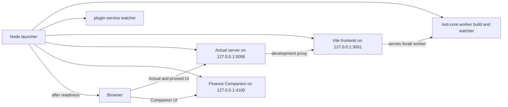

# FIN-66 one-command local launcher design

## Decision

Add one cross-platform Node launcher exposed as:

```powershell
corepack yarn start:finance
```

Node is already required by the repository and avoids Bash, PowerShell-version,
and quoting differences. The launcher coordinates existing package commands; it
does not replace their build or runtime implementations.

## Current failure

Native Windows startup currently requires several terminals and hidden
prerequisites. The root browser command invokes `sh`, and the development
browser expects `packages/loot-core/lib-dist/browser/kcab.worker.dev.js`
without building it. A clean checkout therefore reaches a fatal missing-backend
worker screen even after the frontend starts.

## User workflow

First-time protected configuration remains explicit. The user creates the
Actual account and budget, stores secrets outside the checkout, and supplies
the required `FINANCE_COMPANION_*` bindings in the launcher environment.

Daily use becomes:

1. Open PowerShell in the repository.
2. Load the protected secret values into that process.
3. Run `corepack yarn start:finance`.
4. Sign in to the two local browser tabs.
5. Press `Ctrl+C` once to stop every launcher-owned service.

The command reuses persistent state. It never resets a database, browser
storage, integrity anchor, imported statement, or normalized Amazon record.

## Process layout



All listeners remain loopback-only. The launcher opens the Actual server origin
at `http://127.0.0.1:5006`, not the raw Vite origin. In development, the Actual
server proxies frontend routes to port 3001. Actual's existing first-run logic
then sees its own origin as a valid server and persists that server URL in local
browser storage. The launcher does not automate login or handle a password.

## Startup sequence

The launcher uses only Node built-ins and direct argument arrays with
`shell: false`.

1. Parse `--no-open` and reject unknown arguments.
2. Resolve persistent paths and create missing directories without deleting or
   changing existing content.
3. Validate required non-secret companion bindings, the presence, not the
   value, of each required secret source, and the three artifacts created by
   the documented one-time migration: `companion.sqlite`, Actual API
   `owner.json`, and the integrity anchor.
4. Probe ports 3001, 4100, and 5006. Fail before spawning children if any is
   already accepting connections.
5. Run one-shot loot-core and Finance Companion builds without companion
   secrets, and require `kcab.worker.dev.js` to exist.
6. Start the loot-core build watcher, plugin-service watcher, frontend, Actual
   server, and the already-built companion runtime with prefixed output.
7. Poll bounded readiness:
   - Actual server information endpoint on port 5006;
   - proxied frontend document and `/kcab/kcab.worker.dev.js` through port 5006;
   - companion `/health` on port 4100.
8. Open `http://127.0.0.1:5006` and `http://127.0.0.1:4100`, unless
   `--no-open` was supplied.
9. Remain attached until a child exits or the user requests shutdown.

The launcher starts the repository's committed Yarn release with
`process.execPath` and a direct argument array. This avoids the Windows
`corepack.cmd` plus `shell: false` incompatibility while retaining the exact
Yarn version pinned by the checkout. It does not depend on a globally installed
Yarn binary.

## Persistent paths

Existing explicit environment values win. Otherwise the launcher supplies
stable, non-secret defaults:

| State            | Windows default                                                         | Linux default                                                                  |
| ---------------- | ----------------------------------------------------------------------- | ------------------------------------------------------------------------------ |
| Actual server    | `%LOCALAPPDATA%\\ActualBudgetServer`                                    | `$XDG_DATA_HOME/actual-budget-server` or `~/.local/share/actual-budget-server` |
| Companion data   | `%LOCALAPPDATA%\\ActualFinanceCompanion\\data`                          | `$XDG_DATA_HOME/actual-finance-companion/data`                                 |
| Actual API cache | `%LOCALAPPDATA%\\ActualFinanceCompanion\\actual-api`                    | `$XDG_DATA_HOME/actual-finance-companion/actual-api`                           |
| Integrity anchor | `%LOCALAPPDATA%\\ActualFinanceCompanion\\anchor\\integrity-anchor.json` | `$XDG_DATA_HOME/actual-finance-companion/anchor/integrity-anchor.json`         |

The three companion roots remain disjoint for FIN-60 compatibility. The
launcher reports path names but never secret values.

## Configuration boundary

The launcher may default ports, loopback hosts, origins, and persistent paths.
It must require the existing configuration parser to validate a cloned
environment so direct secret variables remain available for the companion
child. The parser validates budget identity, currency, server URL, and
secret-source exclusivity. The launcher additionally requires the companion
server URL to be exactly `http://127.0.0.1:5006` and verifies that every
configured secret file exists, is a regular file, and is readable before any
child starts. The same preflight requires the companion database, Actual API
owner marker, and integrity anchor; if any is absent, it names the artifact and
points to the one-time `db:migrate` setup rather than starting builds that must
fail. It must not read, generate, store, print, or convert secret values.

The protected `db:migrate` lifecycle owns Actual API root initialization. While
holding the database maintenance lock, it creates `owner.json` exactly once
from the returned companion instance ID, configured budget-binding hash, and a
random 32-byte base64url directory nonce. The root must be an existing canonical
non-symlink directory and otherwise empty when unowned; the canonical marker is
written with exclusive-create semantics and restrictive mode. Later migrations
verify the exact existing marker and never overwrite or silently rebind it. The
launcher only verifies that this initialization exists.

Only the validation process and already-built companion runtime receive
`FINANCE_COMPANION_*` variables. The companion build, worker, plugin, frontend,
and Actual children receive separate minimum environments. Actual receives
`ACTUAL_HOSTNAME=127.0.0.1`, its persistent data root, and
`NODE_ENV=development`; Vite receives its explicit loopback bind and
`BROWSER=none`. Vite must still install the `/kcab` middleware when its internal
worker watcher is disabled, and the sync-server development proxy targets
`http://127.0.0.1:3001` so IPv4-only binds work consistently.

If first-time companion configuration is incomplete, startup fails before any
child is launched and points to the user guide. An optional Actual-only mode is
not part of FIN-66; keeping one daily command avoids two partially supported
startup paths.

## Process ownership and shutdown

Every spawned child is recorded immediately. On `SIGINT`, `SIGTERM`, startup
failure, or unexpected child exit, the launcher stops only those recorded
children and waits for bounded exit. Shutdown also cancels any active readiness
poll immediately; it does not continue polling stopped services until the
readiness deadline. Startup checks the shutdown state after every awaited stage
and immediately before each spawn, so a child cannot be launched after shutdown
has taken its ownership snapshot.

- Windows uses `taskkill /PID <owned-pid> /T` and escalates to `/F` only after
  the grace period.
- POSIX children use their own process groups; the launcher signals only those
  groups and escalates after the same grace period.
- A second shutdown signal may force the already-owned groups, but it never
  scans ports or process names and never kills an unrelated process.

Normal shutdown does not remove generated worker assets. They are disposable
and will be replaced by the next build, while persistent finance state remains
untouched.

## Tests

Use Node's built-in test runner with injected process, readiness, filesystem,
and browser-opening adapters. Focused tests cover:

- Windows executable selection and paths containing spaces;
- a real child-process smoke of Node invoking the committed Yarn release;
- startup order and no browser open before all readiness checks pass;
- missing worker, child failure, occupied port, and readiness timeout;
- missing configuration with secret names only and no secret values;
- missing one-time migration artifacts before child creation;
- exclusive Actual API owner creation plus valid-rerun, mismatch, non-empty,
  and symlink failure cases;
- secret delivery only to the validator and built companion runtime;
- immediate readiness cancellation during shutdown;
- shutdown during a pre-spawn stage with no late child creation;
- `--no-open` and unknown arguments;
- graceful and forced cleanup of only recorded child IDs;
- stable persistent directory reuse across two launches; and
- automatic Actual URL choice through the port-5006 proxied origin.

A lightweight integration smoke starts stub HTTP children on alternate injected
ports; it does not contact Actual, SimpleFIN, or real data. Manual Windows
acceptance runs the real command with synthetic configuration, verifies both
browser pages, stops it once, restarts it, and confirms the same synthetic
state remains.

## Documentation and rollback

Update the user guide so first-time protected setup is separate from daily
startup. Document the two local URLs, automatic same-origin server selection,
persistence, `--no-open`, port-conflict errors, and `Ctrl+C` shutdown.

Rollback is a normal revert of the FIN-66 squash commit. The existing package
commands remain available and no persistent data format changes, migration, or
secret rotation is introduced.
