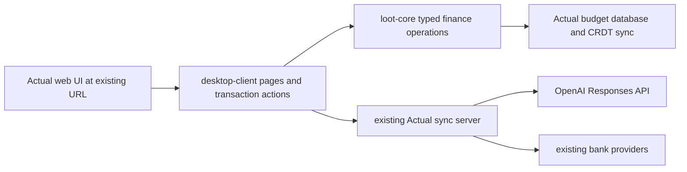

# Native Finance integration for Actual

## Decision

Replace the user-facing Finance Companion with native Actual features. The
budget stays the ledger of record, users use the existing Actual URL and login,
and all ledger changes go through Actual's normal mutation and sync path. There
is no Companion page, port `4100`, login, launcher, SQLite database, adapter
worker, or backup/integrity subsystem after migration.

This is an in-repository integration, not a plugin or an iframe. Reuse the
Companion's pure domain code and fixtures where useful; move or rewrite UI,
data access, persistence, and mutations at Actual seams.

## Scope

Native Actual gains these workflows for the currently open budget:

- expenditure metrics that Actual does not already show (average day/week/month,
  median, category and merchant breakdowns, period change, and rolling spending);
- bulk OpenAI categorization with an allow-list of Actual categories, editable
  global prompt and category guidance, selected/current-filter/date/all scopes,
  an exclude-already-categorized default, preview, individual selection, and
  one undoable apply operation;
- merchant alias proposals and explicit approval to create Actual imported-payee
  rules;
- exact import duplicate protection plus a reconciliation review that can merge
  only user-approved candidates inside Actual;
- recurring-payment detection and review, distinguishing optional subscriptions
  from household or financial bills, with an approved candidate creating or
  updating an Actual schedule;
- Amazon export and user-supplied `.eml` import, charge matching, item detail,
  and explicitly reviewed native notes/categories/splits; and
- manual and scheduled use of Actual's existing bank-sync providers, including
  SimpleFIN.

Existing Actual imports (CSV, OFX/QFX, QIF and supported bank providers),
reports, rules, schedules, transaction editing, reconcile flow, authentication,
sync, backups, and server lifecycle remain the baseline and are reused rather
than duplicated.

Out of scope: browser credential scraping, Gmail OAuth, PDF/OCR statements,
true multi-currency aggregation, a generic transaction-write endpoint, silent
fuzzy deletion/merging, and automatic application of Amazon splits. The first
native pass targets the web app served by an Actual sync server; desktop secret
storage is a follow-up unless its existing secure-storage seam is directly
reusable.

### Reviewed Amazon apply path

Amazon apply is an explicit, native Actual action rather than an automatic
import side effect. The server rebuilds the saved source and revalidates the
current target before changing it. A single allocation can set a selected
category; multiple allocations can create balanced native splits, and the user
may append a concise Amazon note without replacing existing notes. Ambiguous,
stale, reconciled, transfer, off-budget, and existing-split targets never
write. The existing Actual undo history restores the ledger, and an applied
review can be reopened. No Amazon data is sent to a Companion or another app.

## What moves and what is removed

| Keep/adapt from Companion                                                                                                                                         | Remove with Companion                                                                                                                                                                                                                                        |
| ----------------------------------------------------------------------------------------------------------------------------------------------------------------- | ------------------------------------------------------------------------------------------------------------------------------------------------------------------------------------------------------------------------------------------------------------ |
| Pure reconciliation scoring, subscription detection, Amazon parsers/matcher, report calculations, classification DTO validation, fixtures, and synthetic E2E data | `@actual-app/finance-companion`, its HTTP routes/UI, port 4100, local principal/session/CSRF code, Companion SQLite and migrations, integrity anchor, adapter process/queue/lock, Companion configuration, backup/restore, Docker image, and `start:finance` |
| Deterministic explainability/reason codes and stale-target checks                                                                                                 | Companion copies of Actual accounts, categories, transactions, provider credentials, and source-identity registry                                                                                                                                            |
| Existing Actual import identity hardening and bank-sync implementation                                                                                            | Any direct Actual SQLite access or API-directory ownership scheme                                                                                                                                                                                            |

Delete the package and root launcher only after every native route has shipped,
the migration is complete, and the native end-to-end suite passes. Until then it
is unsupported/hidden rather than extended; no new Companion feature work is
allowed.

## Original target architecture (roadmap history)

This section preserves the initial architecture proposal. Where it differs from
the implemented behavior below, the implementation status is authoritative.

### Frontend

Add focused components under the existing desktop-client feature locations:

- transaction-table bulk action and review drawer for categorization and
  reconciliation;
- existing Reports page summary cards/rolling chart;
- Schedules area recurring-candidate panel;
- Import flow reconciliation summary plus an Amazon import/review flow; and
- a Finance section in existing settings for model, prompt, category guidance,
  and clear disclosure of data sent to OpenAI.

Do not introduce a global finance dashboard or a second router. Reuse Actual
selection, filters, mutation/undo, dialog, table, notification, translation,
and accessibility primitives.

### Core and server

Put ledger reads, pure calculations, candidate construction, stale checks, and
narrow finance mutation commands in loot-core. Each command accepts concrete
transaction/category/schedule identifiers and returns a typed outcome; it never
accepts raw SQL, AQL, arbitrary patches, or a client-selected account outside
the current budget.

The existing sync server owns the OpenAI integration that cannot safely run in
the browser:

1. OpenAI requests, with the API key held in the existing server data directory
   or supplied by `OPENAI_API_KEY`, and a small authenticated endpoint that
   validates an allow-listed, redacted request.

The original roadmap also proposed a server-side scheduled invocation of the
bank-sync command. That is not the implemented scheduler and is retained here
only as history.

The server endpoint returns validated structured suggestions only. The client
performs the normal Actual mutation after review. No OpenAI key is stored in
the budget, sent to the browser, included in logs, or synchronized.

## Implemented KISS behavior (FIN-78)

The following storage and workflow details describe the implemented behavior,
not the historical server-side scheduler proposal above.

### Storage and local preferences

Prefer Actual's existing budget data and preferences:

- Transactions, payees, categories, rules, schedules, notes, and splits remain
  native Actual records.
- Per-budget prompt, category guidance, model name, and non-secret finance
  preferences use the established synced-preference mechanism.
- The OpenAI key is a server-local secret file with environment-variable
  override; it is never stored in the budget or returned to the browser.
- Bank-scheduler configuration is a device-local `bankSyncSchedule` preference,
  not server-local state. It runs and resumes only while the Actual browser tab
  is open; there is no headless server job.
- Candidate state is derived from current transactions whenever possible.
- Amazon review keeps only compact, normalized review metadata and decisions so
  a review can be reopened; it discards the original JSON or email after
  parsing. The metadata never stores raw uploads or API keys.

This is Actual-owned metadata, not a Companion database or service. The
original roadmap's server-owned metadata store is not the current scheduler or
review-state design.

## Data flows and mutation rules

Every flow reads a fresh current transaction before apply. A changed, deleted,
split-child, category-missing, or reconciled target returns `stale`/`blocked`
and changes nothing. Every successful batch uses Actual's existing mutation
transaction and undo history. Reconciled transactions are read-only evidence.

| Flow                       | Native flow                                                                                                                                                                                                                                                                                                                | Allowed write                                                                                                                                                                                                                                                                                                                               |
| -------------------------- | -------------------------------------------------------------------------------------------------------------------------------------------------------------------------------------------------------------------------------------------------------------------------------------------------------------------------- | ------------------------------------------------------------------------------------------------------------------------------------------------------------------------------------------------------------------------------------------------------------------------------------------------------------------------------------------- |
| Imports and reconciliation | Existing parser/import preview retains strict `(account, imported_id)` protection. Exact repeated IDs are ignored/updated by the current reconciler. Candidate scoring compares amount, normalized payee, date, pending/posted state and source evidence; fuzzy candidates always open review.                             | User chooses merge/keep-both/defer. Merge revalidates both rows and uses one narrow core operation that preserves the chosen canonical row's protected/manual fields and deletes only the approved redundant, unreconciled row.                                                                                                             |
| OpenAI categorization      | User chooses scope and allowed categories, optionally includes already categorized rows, and reviews the explicit disclosure. Server sends only selected description/payee, amount, date, account label, allowed categories and editable guidance. The cheap configured model must return JSON `{transactionId, categoryId | null, confidence, reason}`. IDs and categories are validated locally; invalid/low-confidence answers are proposals only.                                                                                                                                                                                                                    | User applies selected proposals; one core batch sets category only. It creates no rule and does not overwrite an existing category unless the explicit checkbox was selected. |
| Merchant normalization     | Candidate logic groups imported-payee aliases against confirmed Actual payees; UI shows evidence and a suggested existing payee.                                                                                                                                                                                           | Approval creates a normal imported-payee rule using Actual's rule mutation. Rejection/suppression is metadata only.                                                                                                                                                                                                                         |
| Recurring payments         | Detector examines ledger history, cadence, amount variance, gaps and normalized payee. It reuses existing schedules as evidence and shows cadence/reason/confidence.                                                                                                                                                       | Approval creates/updates one Actual schedule through its existing schedule mutation. No past transaction changes.                                                                                                                                                                                                                           |
| Amazon                     | User uploads an Amazon data export or `.eml`; parse, normalize, match charges, and show item/tax/shipping/refund evidence. Raw input is discarded after parse; normalized review metadata is persisted so the review can reopen.                                                                                           | Only an explicit reviewed apply may write: a single allocation sets a selected category, while multiple allocations become balanced native splits; a concise note is optional. The server revalidates source and target, blocks ambiguous/stale/reconciled/transfer/off-budget/existing-split targets, and Actual undo restores the ledger. |
| Bank sync                  | Manual sync remains Actual's action. The device-local scheduler runs only while the Actual browser tab is open (and resumes when it is open again), then invokes the existing per-account sync mutation for each selected account. It has no server-side schedule, CLI invocation, or headless job.                        | Existing provider sync only; downstream reconciliation rules still apply.                                                                                                                                                                                                                                                                   |
| Reporting                  | Query current Actual transactions using the selected report range/filter; pure integer-money calculations provide total, average day/week/month, median, category and merchant breakdowns, month-over-month change, and rolling 30-day spending while honoring transfers, refunds and split children.                      | None.                                                                                                                                                                                                                                                                                                                                       |

## OpenAI contract

The user chooses the model and supplies the key in native Actual server
settings. Default to the current cost-sensitive `gpt-5.6-luna`; the setting is
editable so cost/availability does not require a release. The request contains
a fixed system instruction, the user's
editable global prompt, allowed category IDs/names/guidance, and the minimum
selected transaction fields. It explicitly forbids categories outside the
allow-list and requires `null` on uncertainty.

Use the OpenAI structured-output capability through the official server SDK.
Validate schema, transaction IDs, category IDs, size limits, and response count
before returning. Rate-limit and cap batches; display an estimated count and
data-disclosure before send. Server logs record only model, count, outcome, and
redacted error class. The UI shows the provider, data fields, model, and that
suggestions are not applied automatically.

## Migration and removal

1. Add native read-only views and pure-core tests while Companion remains
   untouched.
2. Ship each narrow native write operation with stale/reconciled/idempotency
   tests and then wire its review UI.
3. Import only compact, non-secret Companion data that has a direct native
   destination: category guidance, merchant decisions, Amazon applied-link
   fingerprints, and deferrals. The migration previews counts and asks for
   confirmation; it never imports raw source files, sessions, keys, backups, or
   candidate rows that can be recomputed.
4. Run a native synthetic end-to-end migration/restart test. Keep a documented
   export of the Companion database for manual rollback, but do not keep it on
   the normal runtime path.
5. Remove Companion package/scripts/container/docs/configuration and delete its
   data only by an explicit user command after successful migration. A normal
   application upgrade never deletes the old data.

## Parallel delivery boundaries

| Workstream         | Owns                                                             | Must not modify                           |
| ------------------ | ---------------------------------------------------------------- | ----------------------------------------- |
| Core integrity     | import identity hardening, candidate/mutation commands, fixtures | UI components, server OpenAI settings     |
| Categorization     | server OpenAI boundary, preferences, transaction bulk UI         | reconciliation and Amazon mutation code   |
| Reports            | pure metrics and Reports UI                                      | transaction write paths                   |
| Recurring          | detector, native schedule review/UI                              | categorization and Amazon storage         |
| Amazon             | parser/matcher, metadata adapter, import/review UI               | generic reconciliation scoring            |
| Operations/removal | scheduler adaptation, Companion migration/removal, docs          | feature behavior except integration fixes |
| Verification       | synthetic E2E, mutation/race/security regression tests           | production feature implementation         |

The core-integrity command shapes land first and are the only shared dependency
for categorization, reconciliation, recurring schedules, and Amazon applies.
Other read-only workstreams may proceed immediately in parallel.

## Risks and controls

- **Wrong financial mutation:** preview first; narrow typed commands; fresh
  revalidation; no fuzzy automatic merge; actual undo; regression fixtures for
  splits, refunds, pending/posted and reconciled rows.
- **OpenAI privacy/cost/output failures:** explicit disclosure, server-only key,
  minimum data, batch limits, structured output validation, no automatic apply,
  redacted logs and configurable model.
- **Sync/server availability:** all ledger mutations still use Actual's normal
  client/core mechanism; lack of server disables OpenAI and bank sync,
  including the tab-bound scheduled-sync control, and shows actionable setup
  state.
- **Amazon schema variance and ledger safety:** versioned parsers and fixtures,
  user-controlled uploads, raw file deletion after parse, normalized persisted
  review metadata, explicit apply only, server-side revalidation, balanced
  splits, and Actual undo.
- **Migration loss:** no automatic deletion, preview/confirmation, exportable
  old metadata and restart/migration E2E coverage.

## Acceptance criteria

- Actual is the only user-facing app and URL; port 4100, Companion login, and
  `start:finance` are gone after migration.
- All listed finance workflows are reachable from native Actual locations and
  operate on the current budget.
- Categorization supports every requested scope, category allow-list, editable
  prompt/guidance, already-categorized toggle, preview, selective apply, undo,
  and server-only configurable OpenAI key/model.
- Exact duplicate import protection is covered; fuzzy reconciliation requires
  explicit approval. Amazon applies are also explicitly reviewed and
  revalidated; ambiguous and reconciled rows are never changed.
- Recurring review distinguishes optional subscriptions from household or
  financial bills. Approved recurring candidates create or update native
  schedules through Actual commands; approved Amazon reviews use native
  notes/categories/splits and undo.
- Existing imports, reports, schedules, bank sync, login, backup and normal
  startup continue to work without Companion configuration.
- Focused core/server/UI tests plus synthetic browser E2E cover happy paths,
  stale/race cases, restart persistence, OpenAI validation/redaction, and
  every financial mutation.

## OpenAI references

- [Models](https://developers.openai.com/api/docs/models)
- [GPT-5.6 Luna](https://developers.openai.com/api/docs/models/gpt-5.6-luna)
- [Responses API text generation](https://developers.openai.com/api/docs/guides/text)
- [Structured Outputs](https://developers.openai.com/api/docs/guides/structured-outputs)
